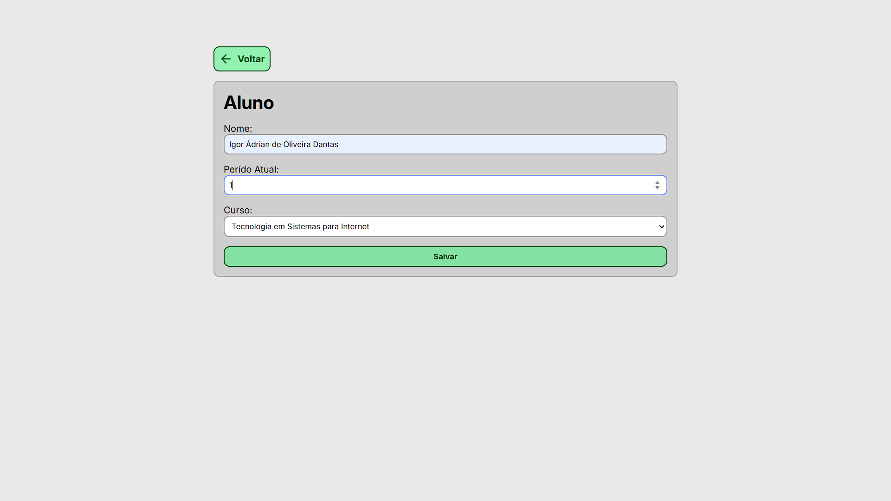
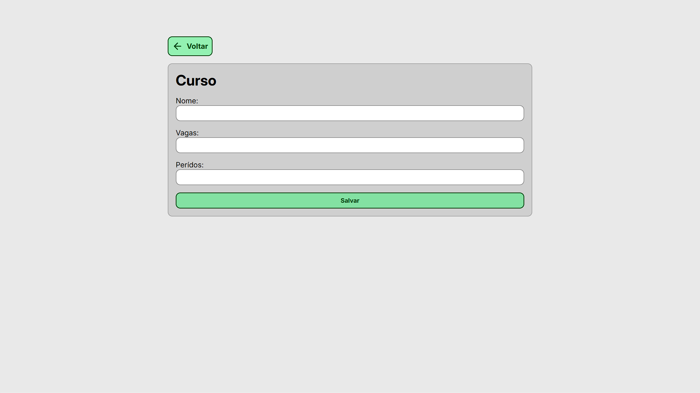
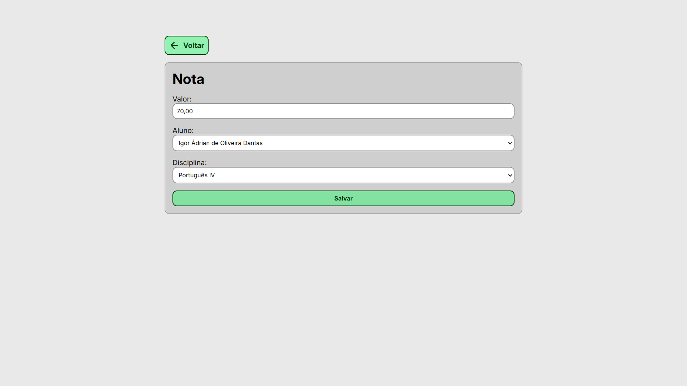
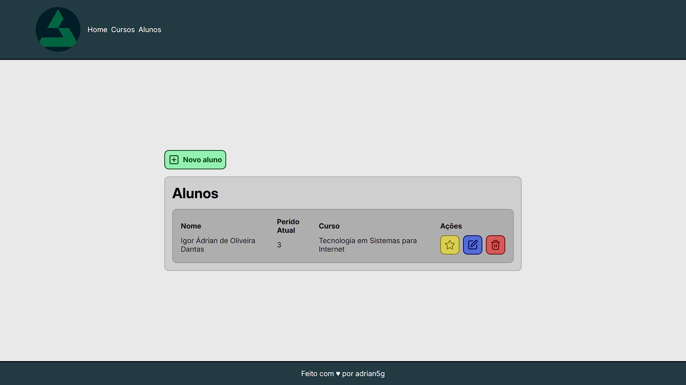
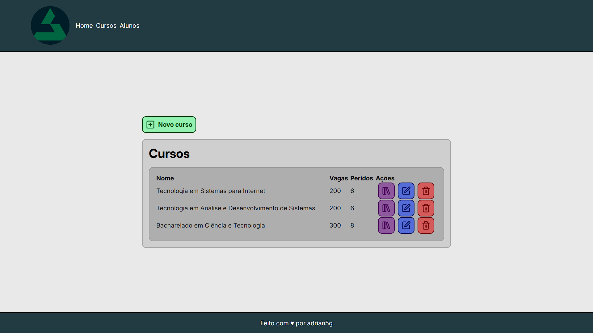
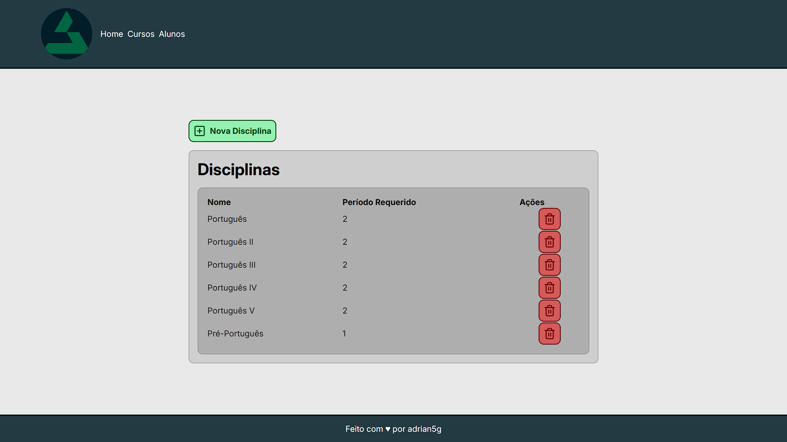
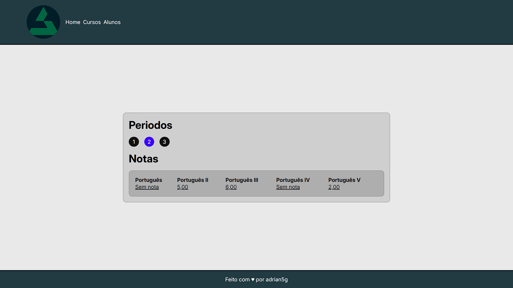
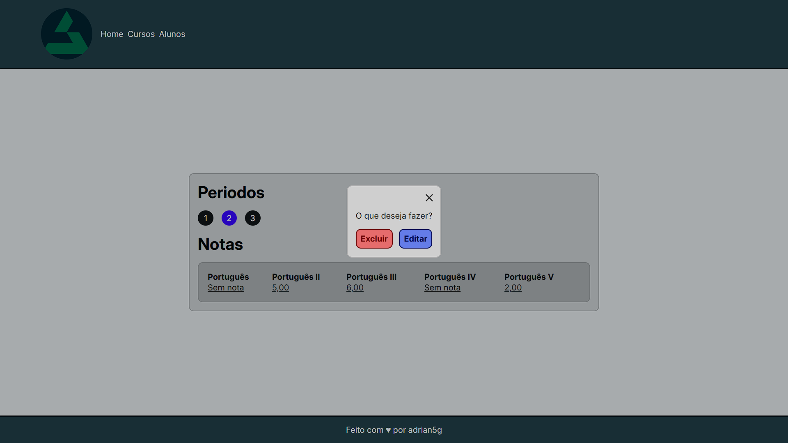
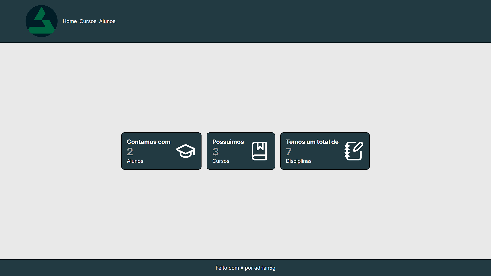

# Projeto Escola

Primeiro projeto com django onde me aprofundei nos conceitos fundamentais da tecnologia e também aprimorei outros conceitos vistos antes.

### Objetivo do Projeto:

Ser um pequeno gerenciador de cursos onde você pode gerenciar os cursos, as disciplinas dos cursos, os alunos, em qual curso os alunos estão e as notas dos alunos em cada disciplina do curso que estão.

### Tecnologias usadas:

- Javascript
- HTML5
- CSS3
- Python
- Django

### Características:

- Fullstack
- Layout responsivo
- Django
- Usa CDN para os Ícones

### Demonstrações:

#### 1. Formulários

#### 2. Formulários

#### 3. Extras

